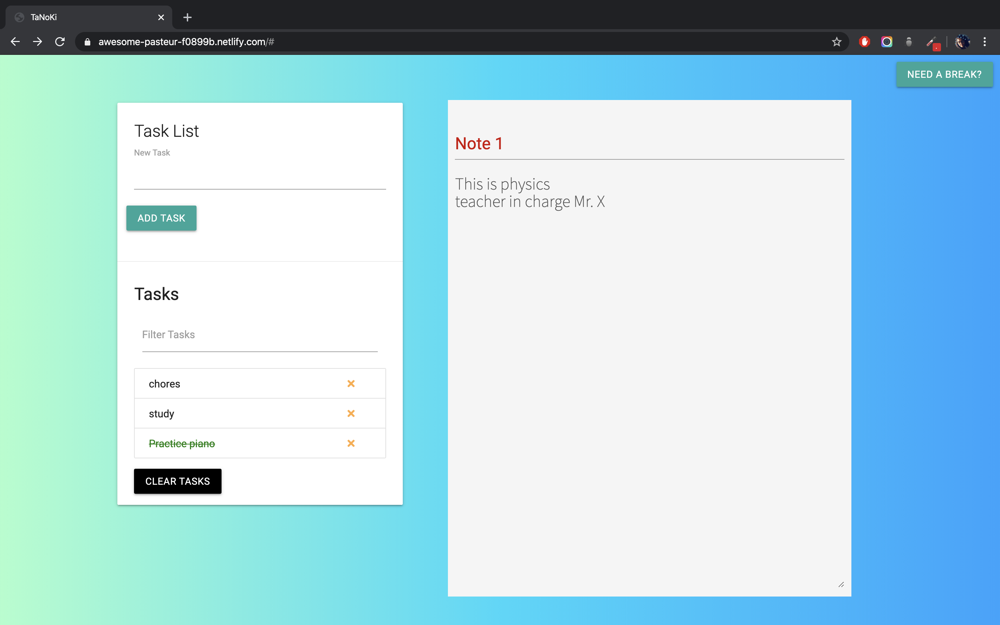

# TaNoKi
Listing down any chore (task) that you remember while taking notes in a lecture is now possible side by side.

A task list that can add, remove and store tasks is made in this project.\
There is also a Notes page in order to take notes.\
Also, for those who _Do Not_ believe in **All work no Play**, there is a button that takes you to a Break Room. Press any key from A-Z there and you're going to get mesmerised by what's happening.
\
\
\

## GitHub Actions
In order to use the GitHub Actions, an account on Push by Techulus is needed.

#### Method
Your API Key needs to be added to Secrets in Repository > Settings > Secrets > Add a new secret \
The _Name_ will be API_KEY \
_Value_ will be the API Key your Push account holds. \
(Please do not share your API Key with anybody)

### Usage
This starts working once you've added these action files to your code and made the first Push Commit. Once this is done, after about every 10 minutes you will receive a push notification on your Android or IOS device that will remind you to keep working. 

## Built with : Visual Studio Code
* Using : 
  - GitHub Actions
  - HTML
  - CSS
  - JS
  - JQuery
* Libraries like :
  - paper.js
  - sounds.js\
  were also used

### A glimpse of the 'Need a Break?' Page

[Check out the YouTube Video here](https://youtu.be/CCund6BqcVI "TaNoKi Video")

#### PS: This project has a lot of functionalities that can be added. Since I have a few time constraints because of college work, I'll add the funtionalities gradually. \

#### License
MIT License
